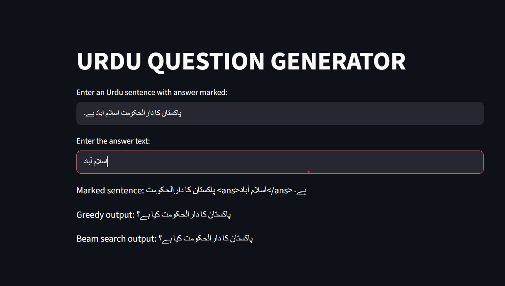

# Urdu Sequence-to-Sequence Question Generation

Group members: Aimen (23F-0056), Aliza (23F-0057)

## Problem

Given an Urdu sentence with the answer marked inside it (`<ans> ... </ans>`), generate the
question that the answer responds to — a from-scratch RNN encoder-decoder with attention,
trained on the UQA dataset.

## Setup

1. Clone this repo
2. `pip install -r requirements.txt`
3. To retrain: open `run_on_colab.ipynb` in Colab or Kaggle (GPU runtime), clone the repo,
   and run the training script.
4. To run the front end locally: see below.

## How to Run

- Data prep: `python src/data_prep.py`
- Train tokenizer: `python src/tokenizer_train.py`
- Train model: `python src/train.py` (or via the notebook, on Colab/Kaggle GPU)
- Evaluate: `python src/evaluate.py`
- Front end: `cd frontend && streamlit run app.py`

## Model Configuration

| | |
|---|---|
| Encoder | 2-layer bidirectional LSTM |
| Decoder | 2-layer LSTM with Bahdanau attention, weight-tied output layer |
| Embedding size (E) | 256 |
| Hidden size (H) | 512 |
| Vocabulary size | 8,000 (SentencePiece unigram) |
| Dropout | 0.3 |
| Trainable parameters | TODO — print via `sum(p.numel() for p in model.parameters())` |
| Optimiser | Adam, lr=1e-3, ReduceLROnPlateau (factor=0.5, patience=1) |
| Batch size | 64 |
| Epochs / early stopping | up to 15, patience=3 |
| Beam size | 3 |

## Dataset Statistics

| | Train | Validation | Wiki-UQA |
|---|---|---|---|
| Rows in raw dataset | 124,745 | 16,824 | 210 |
| Answerable rows | 83,018 | 11,169 | 210 |
| Pairs after length filter | 75,003 | 10,018 | 177 |
| Mean source / target length | 32.6 / 11.9 | 33.2 / 12.3 | 31.7 / 11.4 |

## Automatic Metrics

| Split | Decoding | BLEU-4 | ROUGE-L | PPL | `<unk>` % |
|---|---|---|---|---|---|
| UQA valid | greedy | 3.70 | 0.223 | 43.01 | 1.42 |
| UQA valid | beam (k=3) | 4.23 | 0.234 | 43.01 | 1.35 |
| Wiki-UQA | greedy | 1.51 | 0.198 | 65.46 | 7.32 |
| Wiki-UQA | beam (k=3) | 1.74 | 0.192 | 65.46 | 6.55 |

## Human Evaluation (50 samples)

| | Fluency | Relevance | Answerability |
|---|---|---|---|
| Member 1 (% yes) | TODO | TODO | TODO |
| Member 2 (% yes) | TODO | TODO | TODO |
| Cohen's κ | TODO | TODO | TODO |

## Figures

- `results/figures/train_length_hist.png`, `valid_length_hist.png` — source/target length histograms
- `results/figures/loss_curve.png` — training and validation loss per epoch
- `results/figures/attention_heatmap.png` — attention over one example
- `results/figures/frontend_screenshot.jpeg` — front end in action

## Front End Screenshot

## Qualitative Samples

See `results/samples.tsv` for 50 validation outputs. Five good and five bad examples,
with failure types for the bad ones, are discussed in the blog post.

## Discussion

- **Which question words does the model get right most often?** TODO
- **Where does beam search help, and where does it hurt?** Beam search noticeably
  outperforms greedy decoding on longer/harder source sentences — in one test case,
  greedy decoding degraded into repetitive, ungrammatical output on a ~35-word sentence
  while beam search (k=3) produced a fluent, grammatically correct question. On shorter,
  common-knowledge sentences (e.g. capital cities), both decoding strategies produced
  identical, correct output.
- **Why does performance drop on Wiki-UQA, and what does that say about translated
  training data?** TODO

## Blog & LinkedIn

- Blog: TODO
- LinkedIn: TODO